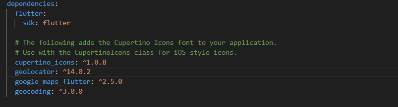
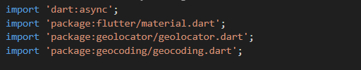
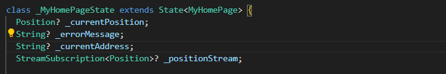
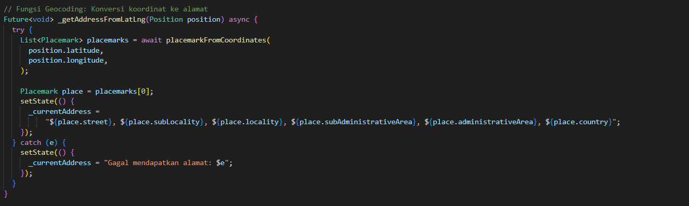
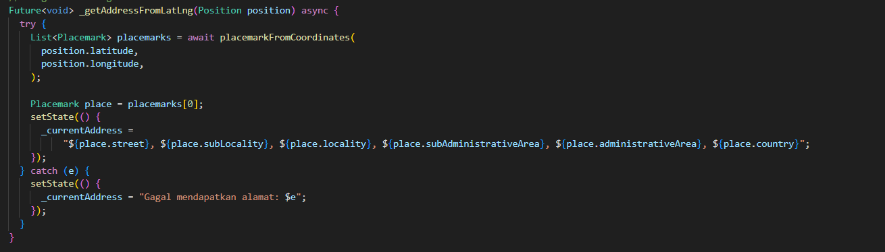
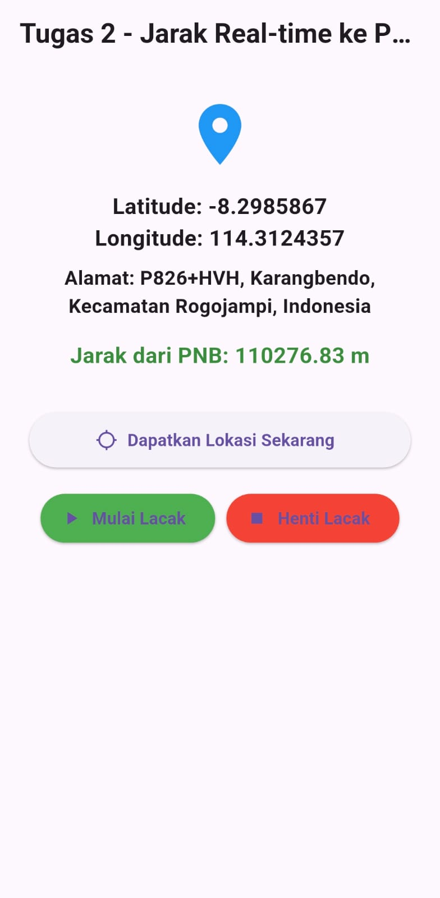

**Tugas 1**: Geocoding (Alamat dari Koordinat)
Saat ini kita hanya menampilkan Lat/Lng. Buatlah agar aplikasi menampilkan alamat
(nama jalan, kota, dll) dari koordinat yang didapat.
Petunjuk:
1. Anda sudah menambahkan paket geocoding di pubspec.yaml.
   
2. Import paketnya: import ’package:geocoding/geocoding.dart’;
   
3. Buat variabel String? currentAddress; di MyHomePageState.
   
4. Buat fungsi baru getAddressFromLatLng(Position position).

5.  Panggil fungsi getAddressFromLatLng( currentPosition!) di dalam getLocation
dan startTracking (di dalam .listen()) setelah setState untuk currentPosition.

6. Tampilkan currentAddress di UI Anda, di bawah Lat/Lng.

**Tugas 2**: Jarak Real-time ke Titik Tetap
Manfaatkan fungsi Geolocator.distanceBetween dari Langkah 4.
1. Buat variabel String? distanceToPNB; di MyHomePageState.
2. Di dalam startTracking (di dalam .listen()), panggil fungsi untuk menghitung
jarak:
3. Simpan hasilnya di distanceToPNB menggunakan setState.
4. Tampilkan distanceToPNB di UI agar jaraknya ter-update secara real-time saat
Anda bergerak
